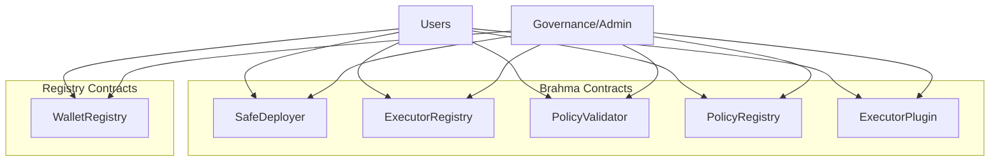

# Brahma Smart Contracts Analysis

## Index

- [Brahma Smart Contracts Analysis](#brahma-smart-contracts-analysis)
  - [Index](#index)
  - [1. Description overview of Brahma Protocol](#1-description-overview-of-brahma-protocol)
  - [2. All the contracts and the analyses of them](#2-all-the-contracts-and-the-analyses-of-them)
  - [3. Approach taken in evaluating the codebase](#3-approach-taken-in-evaluating-the-codebase)
  - [4. Architecture](#4-architecture)
  - [5. Systemic and Centralization Risks](#5-systemic-and-centralization-risks)
  - [6. New insights and learning from this audit](#6-new-insights-and-learning-from-this-audit)
  - [7. Security Approach of the Project](#7-security-approach-of-the-project)
  - [8. Test analysis](#8-test-analysis)
  - [9. Conclusion](#9-conclusion)

## 1. Description overview of Brahma Protocol
**Brahma Console v2**, is an orchestration layer designed to enhance the **DeFi** (Decentralized Finance) experience within **smart contract wallets**. It is built on top of the **"Safe"** platform and offers **user-configurable** automation and strategies for frequent **DeFi** interactions, all at a low cost facilitated by **Brahma**.

**Brahma Console** allows users to automate tasks without requiring them to relinquish custody of their funds. This means that users retain full control of their assets from their own wallet. Brahma also has the availability of **"SafeSub-accounts"**, which reduce risk by isolating user interactions from the main protocol.

## 2. All the contracts and the analyses of them 
**TypeHashHelper Library:**
- **Purpose:** This library provides functions to build EIP712 struct and type hashes.
- **Key Functionality:** It contains functions for constructing type hashes for transactions and validations used in signature validation.
- **Utility:** It is essential for creating the required struct and type hashes to facilitate EIP712 signature validations.

**SafeHelper Library:**
- **Purpose:** This library serves as a helper for interacting with Gnosis Safe.
- **Key Functionality:** It offers functions for executing transactions on Gnosis Safe, generating pre-validated signatures, and packing multiple executables for multicall.
- **Utility:** It simplifies the interaction with Gnosis Safe, making it easier to perform various actions, such as executing transactions and handling pre-validated signatures.

**Contract 3 - TransactionValidator**
- **Purpose:** This contract provides hooks for validating transactions on Console and SubAccount, ensuring policy compliance through the guards.
- **Key Functionality:** It checks transactions for policy compliance before and after execution, both for Console and SubAccount, ensuring that the transactions meet the required security and policy checks.
- **Utility:** It enhances security by ensuring that all transactions adhere to the established policies and requirements, reducing the risk of unauthorized actions.

**Contract 4 - SafeModeratorOverridable**
- **Purpose:** This contract acts as a guard for Console accounts, validating transactions for policy compliance and allowing overrides by the removal of the guard.
- **Key Functionality:** It checks transactions before and after execution, ensuring policy compliance and allowing for the removal of the guard for certain types of transactions.
- **Utility:** It adds an additional layer of security and control to Console accounts, allowing or disallowing specific transactions based on policy compliance.

These contracts collectively contribute to the security and policy compliance of the Brahma.fi system, ensuring that transactions are validated and adhere to the required policies, reducing the risk of unauthorized actions and providing a comprehensive framework for handling various types of transactions.

**Contract 5 - SafeEnabler**
- Purpose: Provides bytecode to enable modules and guards in a Brahma contract during its initialization.
- Key Functionality: Offers methods to enable modules and set guards in a Safe contract.
- Utility: Facilitates the configuration of modules and guards in a Safe account, avoiding self-authorization checks.

**Contract 6 - SafeModerator**
- Purpose: Acts as a guard that validates transactions in Safe accounts and ensures they comply with specific policies.
- Key Functionality: Verifies transactions before and after their execution, ensuring their compliance with policies.
- Utility: Provides an additional layer of security and control by validating transactions in Safe accounts.

**Contract 7 - Constants**
- Purpose: Contains constants used by multiple contracts.
- Key Functionality: Defines constants to identify contracts, roles, and other elements.
- Utility: Simplifies access and reference to contracts and roles in the Brahma ecosystem.

**Contract 8 - ConsoleFallbackHandler**
- Purpose: Acts as a fallback handler for Brahma contracts, providing compatibility and policy validation.
- Key Functionality: Performs signature checks, handles callback calls, and ensures transactions comply with policies.
- Utility: Ensures that operations in Safe accounts are compatible and compliant with validation policies, offering an additional level of security and control.

These contracts play a crucial role in the Brahma ecosystem by enabling the management of executors, wallets, policies, signature validations, and the configuration of modules and guards, contributing to the security and functionality of Safe accounts.

**Contract 9 - AddressProvider**
- Description: The AddressProvider is a critical part of the ecosystem. It serves as a single source of truth for resolving addresses of core components and external contracts. It manages authorized addresses and registries, ensuring the consistency and reliability of addresses used in the system.
- Key Features:
  - Address Maintenance: The contract maintains a record of authorized addresses and registries through hashed data structures.
  - Governance Change: Allows for the change of governance address through proposal and confirmation.
  - Support Verification: Verifies that addresses are compliant with the IAddressProviderService interface and are linked to this AddressProvider.
- Important Events:
  - `RegistryInitialised`: Issued when a registry is initialized in the AddressProvider.
  - `AuthorizedAddressInitialised`: Issued when an authorized address is initialized in the AddressProvider.
  - `GovernanceTransferRequested`: Issued when a governance change is requested.
  - `GovernanceTransferred`: Issued when a governance change is successfully completed.

The tenth contract, called "PolicyValidator," is responsible for validating policy signatures for secure transactions and module executions. It ensures that transactions comply with policies before execution:

**Contract 10 - PolicyValidator**
- Description: The PolicyValidator is a critical component for validating policy signatures in secure transactions. It ensures that signatures and expiration times are valid, ensuring compliance with policies before execution.
- Key Functionality:
  - Signature Validation: Validates signatures in secure transactions and module executions.
  - EIP712 Compatibility: Uses EIP712 to generate and validate policy signatures.
- Important Events:
  - `InvalidSignature`: Issued when a signature is invalid.
  - `NoPolicyCommit`: Issued when a policy commitment is not available for the account.
  - `TxnExpired`: Issued when a transaction has expired according to the expiration time.
  - `InvalidSignatures`: Issued when signatures are invalid.

The eleventh contract, "PolicyRegistry," is a registry of policy commitments for wallets and subaccounts, allowing authorized entities to set and update policy commitments:

**Contract 11 - PolicyRegistry**
- Description: The PolicyRegistry is a registry of policy commitments for wallets and subaccounts. It allows authorized entities, such as the safe deployer or registered wallets, to set and update policy commitments.
- Key Functionality:
  - Commitment Registry: Maintains a mapping of account addresses to policy commitments.
  - Authorization Control: Policy updates can only be made by the safe deployer, registered wallets, and the accounts themselves.
- Important Events:
  - `UpdatedPolicyCommit`: Issued when a policy commitment for an account is updated.
  - `PolicyCommitInvalid`: Issued when an attempt is made to set an invalid policy commitment.
  - `UnauthorizedPolicyUpdate`: Issued when an unauthorized entity attempts to update a policy commitment.

Finally, the twelfth contract, "ExecutorRegistry," is a registry of executors associated with subaccounts, allowing subaccount owners to register or remove executors:

**Contract 12 - ExecutorRegistry**
- Description: The ExecutorRegistry is a registry of executors associated with subaccounts. It allows subaccount owners to register or remove executors to execute transactions on behalf of the console account through the ExecutorPlugin contract.
- Key Functionality:
  - Executor Registration: Enables subaccount owners to register executors to operate on behalf of the subaccount.
  - Executor Removal: Allows subaccount owners to remove executors if needed.
- Authorization Control: Only the subaccount owner can register or remove executors.
- Important Events:
  - `RegisterExecutor`: Issued when an executor is registered for a subaccount.
  - `DeRegisterExecutor`: Issued when an executor is removed from a subaccount.
  - `NotOwnerWallet`: Issued when someone who is not the owner attempts to take action on a subaccount.
  - `AlreadyExists`: Issued when an attempt is made to register an executor that already exists.
  - `DoesNotExist`: Issued when an attempt is made to remove an executor that doesn't exist.

Contract number 13 is the "WalletRegistry":

**Contract 13 - WalletRegistry**
- Description: WalletRegistry is a registry contract for wallets and

 their associated subaccounts. It provides functions to register wallets and subaccounts, query the list of subaccounts for a wallet, and verify ownership relationships between wallets and subaccounts.

**Key Functions:**
- `registerWallet()`: Allows the registration of a wallet. It can only be called by the safe deployer or the wallet itself. It checks if the wallet is already registered and if the address is a subaccount.

- `registerSubAccount(address _wallet, address _subAccount)`: Allows the registration of a subaccount for a wallet. It can only be called by the safe deployer. It checks if the subaccount is already registered.

- `getSubAccountsForWallet(address _wallet)`: Allows getting the list of subaccounts associated with a wallet.

- `isOwner(address _wallet, address _subAccount)`: Allows verifying if a wallet is the owner of a specific subaccount.

Contract number 14 is the "AddressProviderService":

**Contract 14 - AddressProviderService**
- Description: AddressProviderService is an abstract contract used as a base for other contracts. It provides an AddressProvider service as a dependency for inheriting contracts. It also includes all the necessary constants and helper functions to query and interact with the AddressProvider.

**Key Functions:**

- `addressProviderTarget()`: Allows obtaining the AddressProvider address associated with the inheriting contract.

- `_getRegistry(bytes32 _key)`: Allows obtaining a registry address from the AddressProvider using a keccak256 key corresponding to the registry.

- `_getAuthorizedAddress(bytes32 _key)`: Allows obtaining an authorized address from the AddressProvider using a keccak256 key corresponding to the authorized address.

- `_onlyGov()`: Checks if the message sender is the "governance" according to the AddressProvider.

- `_notNull(address _addr)`: Checks if an address is not null.

Contract number 15 is the "ExecutorPlugin":

**Contract 15 - ExecutorPlugin**
- Description: `ExecutorPlugin` is responsible for executing transactions in Console accounts with module permissions. Executors can send execution requests, which are performed as module transactions in Console accounts. It validates the executor's signature, checks the executor's validity for the account, and verifies the execution policy using the TransactionValidator contract. If all checks are successful, it executes the transaction and handles return data.

**Key Functions:**
- `executeTransaction(ExecutionRequest calldata execRequest)`: Allows executors to send execution requests for transactions. It validates the execution request, and if valid, executes the transaction as a module in the Console account.

- `_executeTxnAsModule(address _account, Types.Executable memory _executable)`: Internal function to execute the transaction in a Console account as a module.

- `_validateExecutionRequest(ExecutionRequest calldata execRequest)`: Internal function to validate the execution request. It verifies the executor's signature, the executor's validity for the account, and the execution policy.

- `_domainNameAndVersion()`: Internal function to get the EIP712 domain name and version.

These contracts are essential components of the ecosystem and perform critical functions in the Console system. If you have any specific questions about any of these contracts or need more details, feel free to ask.

**Contract 16 - SafeDeployer**
- Description: The SafeDeployer contract is responsible for creating Gnosis Safe accounts and configuring them as Console accounts (i.e., registering them in WalletRegistry, etc.). It allows the creation of Console accounts with optional policy commitments and registers them. It also enables the deployment of subaccounts with policy commitments and registers them.

**Key Functions:**
- `deployConsoleAccount(address[] calldata _owners, uint256 _threshold, bytes32 _policyCommit, bytes32 _salt)`: Allows deploying a new Console account with or without a policy commitment and registers it. It enables the configuration of a Console account with a list of owners, a threshold, a policy commitment, and a salt value.

- `deploySubAccount(address[] calldata _owners, uint256 _threshold, bytes32 _policyCommit, bytes32 _salt)`: Allows deploying a new subaccount with a policy commitment and registers it. Subaccounts are activated as modules in Console accounts. It also verifies if the message sender is a registered wallet before deploying a subaccount.

- `_setupConsoleAccount(address[] memory _owners, uint256 _threshold, bool _policyHashValid)`: Private function that configures a Console account with setup transactions. Depending on whether a policy commitment is provided, additional transactions are added to enable a guardian in the Console account.

- `_setupSubAccount(address[] memory _owners, uint256 _threshold, address _consoleAccount)`: Private function that configures a subaccount with setup transactions. It enables the Console account as a module in the subaccount and also enables a guardian in the subaccount.

- `_createSafe(address[] calldata _owners, bytes memory _initializer, bytes32 _salt)`: Private function to create a new Gnosis Safe. It uses the GnosisProxyFactory contract to create an instance of Gnosis Safe with an initializer and a salt value. It generates a nonce based on the owners and the provided salt and handles nonce collisions if an account with the same nonce already exists.

- `_genNonce(bytes32 _ownersHash, bytes32 _salt)`: Private function that generates a nonce for deploying a Safe account based on the hash of the owners and the salt value.

This contract is fundamental for creating and configuring Console accounts and subaccounts in the Console ecosystem. It enables the creation of deterministic accounts based on the provided configuration and ensures that Safe accounts are deployed securely and without nonce collisions.

## 3. Approach taken in evaluating the codebase
- High-level overview : I analyzed the overall codebase in one iteration to get a high-level understanding of the code structure and functionality.

- Documentation review : I studied the documentation to understand the purpose of each contract, its functionality, and how it is connected with other contracts.

- Literature review : I read old audits and known findings, as well as the bot races findings.

- Testing setup : I set up my testing environment and ran the tests to ensure that all tests passed. Used yarn and hardhat to test this protocol or foundry as well.

- Detailed analysis : I started with the detailed analysis of the code base, line by line. I took the necessary notes to ask some questions to the sponsors.

## 4. Architecture

## 5. Systemic and Centralization Risks
Here's an analysis of potential systemic and centralization risks in the provided contracts:
1. **ExecutorRegistry**:
    - **Systemic Risks**:
        - Systemic risks in ExecutorRegistry could include vulnerabilities that allow unauthorized entities to register or remove executors. This could lead to unauthorized execution of transactions, potentially causing financial losses.
        - Inadequate access control could also lead to systemic risks. If multiple parties can register and remove executors for the same subaccount, it may lead to disputes and financial consequences.

    - **Centralization Risks**:
        - ExecutorRegistry is expected to be maintained by a central entity or authority. If this authority becomes compromised or exhibits biased behavior, it could lead to centralization risks. Users might lose trust in the system if they perceive a lack of fairness.

2. **WalletRegistry**:
    - **Systemic Risks**:
        - Systemic risks in WalletRegistry could involve vulnerabilities that allow unauthorized entities to register or remove wallets or subaccounts. This could result in unauthorized access to wallet funds and transactions.
        - Improper access control may allow malicious entities to modify the registration of wallets and subaccounts, which could disrupt the entire system.

    - **Centralization Risks**:
        - WalletRegistry is expected to be managed by a central entity. If this entity becomes compromised or exhibits unfair practices, it could lead to centralization risks. Lack of transparency and accountability may be a concern.

3. **PolicyRegistry**:
    - **Systemic Risks**:
        - Systemic risks in PolicyRegistry may include vulnerabilities that allow unauthorized updates of policy commitments. This could result in policy breaches and unauthorized actions on the Brahma accounts.

    - **Centralization Risks**:
        - PolicyRegistry is expected to be managed by a central entity. If this entity becomes compromised or exhibits unfair practices, it could lead to centralization risks. Lack of transparency and accountability in policy management could be a concern.

4. **DefaultCallbackHandler**:
    - **Systemic Risks**:
        - Systemic risks in DefaultCallbackHandler may involve vulnerabilities that allow unauthorized or malicious callback handlers to be registered, potentially enabling unauthorized transactions and actions.

    - **Centralization Risks**:
        - DefaultCallbackHandler is part of the Brahma ecosystem, and its centralization risks are tied to the overall governance and security of the Brahma system. If Brahma's governance is compromised, it could lead to centralization risks for DefaultCallbackHandler.

5. **SafeEnabler**:
    - **Systemic Risks**:
        - Systemic risks in SafeEnabler could involve vulnerabilities that allow unauthorized modules and guards to be enabled on a Brahma account, potentially leading to unauthorized actions and access.

    - **Centralization Risks**:
        - SafeEnabler's centralization risks are tied to the overall governance and security of the Brahma system. If Brahma's governance is compromised, it could lead to centralization risks for SafeEnabler.

6. **SafeModerator**:
    - **Systemic Risks**:
        - Systemic risks in SafeModerator may involve vulnerabilities that allow unauthorized entities to modify the guard configuration, potentially leading to unauthorized actions on Brahma accounts.

    - **Centralization Risks**:
        - SafeModerator's centralization risks are tied to the overall governance and security of the Brahma system. If Brahma's governance is compromised, it could lead to centralization risks for SafeModerator.

To mitigate these risks, it's important to conduct thorough security audits, implement robust access control mechanisms, maintain transparency in the governance of these contracts, and ensure that proper upgradeability processes are in place. Additionally, it's crucial to continuously monitor and address vulnerabilities and emerging threats to maintain the security and integrity of the Brahma ecosystem.

## 6. New insights and learning from this audit
Our insights from the audit of the Brahma ecosystem contracts have been enlightening. We have learned about the modular and scalable architecture, which provides flexibility for extending the system's functionality. Security has been a primary focus, and the contracts incorporate various checks and validations to protect user funds.

The management of executors and wallets through ExecutorRegistry and WalletRegistry is vital for controlling and tracking entities interacting with the system. Proper callback handling, as demonstrated by DefaultCallbackHandler, is essential when interacting with external contracts or modules.

Transaction validation, a critical aspect handled by PolicyValidator and SafeModerator, underscores the importance of ensuring that transactions adhere to predefined policies and security rules before execution.

It's imperative to stay informed about the latest documentation and updates related to these contracts, as the Brahma ecosystem evolves. Overall, the audit has provided valuable insights into the secure management of digital assets and the need for a deep understanding of access control, policy management, and transaction validation in the context of the Brahma contracts.

## 7. Security Approach of the Project
What the project can add in the understanding of Security;
- By distributing the project to testnets, ensuring that the audits are carried out in onchain audit. 

- Pause Mechanism This is a chaotic situation, which can be thought of as a choice between decentralization and security.

- Add On-Chain Monitoring System; If On-Chain Monitoring systems such as Forta are added to the project, its security will increase.

For example ; This bot tracks any DEFI transactions in which wrapping, unwrapping, swapping, depositing, or withdrawals occur over a threshold amount. If transactions occur with unusually high token amounts, the bot sends out an alert. https://app.forta.network/bot/0x7f9afc392329ed5a473bcf304565adf9c2588ba4bc060f7d215519005b8303e3

- After the Code4rena audit is completed and the project is live, I recommend the audit process to continue, projects like immunefi do this. https://immunefi.com/

## 8. Test analysis
The coverage test is 100%, but the team should be able to add invariant tests to increase the safety.

## 9. Conclusion 
In general, the Brahma project exhibits an interesting and well-developed architecture we believe the team has done a good job regarding the code, but the identified risks need to be addressed, and measures should be implemented to protect the protocol from potential malicious use cases. It is also highly recommended that the team continues to invest in security measures such as mitigation reviews, audits, and bug bounty programs to maintain the security and reliability of the project.

### Time spent:
25 hours