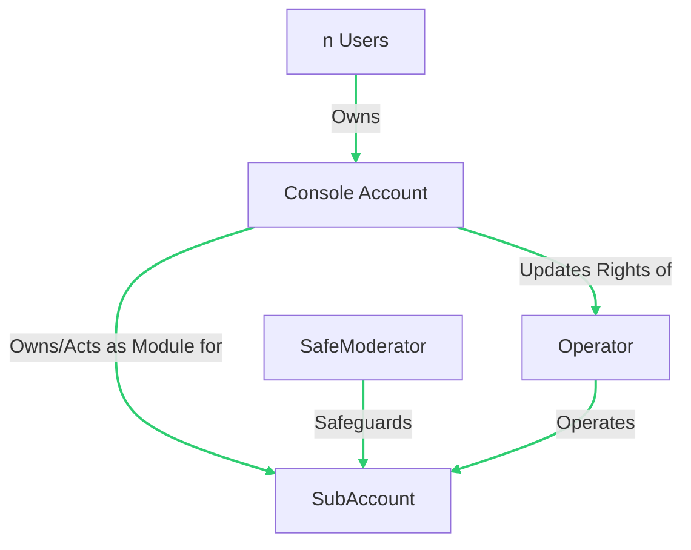

# Brahma - audit analysis

- by InvitedTea |  @invitedTea  |  Vicky@Keybox.ai

## Project Description 
### **Brahma Console v2**
Brahma Console v2 is an advanced orchestration layer tailored for smart contract wallets in the DeFi space. This platform emphasizes:
- **Automation**: User-customizable strategies for frequent DeFi operations, enhancing efficiency.
- **Security**: Users retain full custody of their funds while enjoying automation, ensuring peace of mind.
- **Cost-Effectiveness**: Affordable solutions powered by Brahma, making DeFi more accessible.

### **Key Components**:
- **Console Account**: A standard Gnosis safe accessible by multiple users, acting as the primary account for users.
- **SubAccount**: Operated by delegate accounts termed `Operators` and owned by the `Console Account`. It serves as a secondary layer, enabling specific transaction permissions and increased security.
- **Operator**: A `delegated owner` of the subAccount, ensuring transactions align with set policies. Their permissions are modifiable by the overarching `ConsoleAccount`.
- **Executor**: An authorized account that can execute module transactions on a `subAccount` using the `ExecutorPlugin`.

## Approach 
During the analysis, we focused on thoroughly understanding the codebase and providing recommendations to improve its functionality.

**We divided the audit into 4 main parts. The examined strategies were:**

1. **Libraries**
    - src/libraries/TypeHashHelper.sol
    - src/libraries/SafeHelper.sol
    - and other library-related contracts.

2. **Core Components**
    - src/core/TransactionValidator.sol
    - src/core/SafeModeratorOverridable.sol
    - src/core/SafeEnabler.sol
    - src/core/SafeModerator.sol
    - src/core/Constants.sol
    - src/core/ConsoleFallbackHandler.sol
    - and other core functionalities.

3. **Registries & Services**
    - src/core/registries/PolicyRegistry.sol
    - src/core/registries/ExecutorRegistry.sol
    - src/core/registries/WalletRegistry.sol
    - src/core/AddressProviderService.sol
    - and other related services.

4. **External Integrations**
    - `safe-contracts/*`
    - `@openzeppelin/*`
    - `solady/*`
    - and references to other external contracts or libraries.

---

## Audit Practices according this project

- **System Architecture Understanding**: Deeply understand the overarching architecture, such as Brahma Console v2's orchestration layer, its automation capabilities, and the various account types (`Console Account`, `SubAccount`, `Operator`, `Executor`) and their interactions.

- **Multi-Chain Compatibility**: Given the system operates on multiple blockchains, ensure robustness, compatibility, and security across different blockchain environments.

- **Role-Based Access Control**: Rigorously validate access controls, especially for trusted roles like `Guardian`, `Trusted Validator`, and `Governance`. Ensure that roles are clearly defined, and functions are accessible only to the intended roles.

- **EIP Compliance**: Ensure that contracts adhere to relevant Ethereum Improvement Proposals (EIPs). For instance, `PolicyValidator` and `ExecutorPlugin` should comply with `EIP712`.

- **External Wallet Validation**: Given potential vulnerabilities with user-imported wallets, implement rigorous validation, sandboxing, and containment strategies to prevent malicious actions.

- **System Invariants**: Regularly check system invariants to ensure state consistency and system integrity. For example, the main Console Account should always stay as a module enabled on any subaccount it owns.

- **Delegatecall Security**: Be cautious with the use of `delegatecall`, especially when allowing external contracts to introduce behavior changes. Ensure robust access controls and verify the trustworthiness of contracts being interacted with using `delegatecall`.

- **Input Validation**: Ensure thorough input validation for all functions. Improper input validation can lead to unauthorized actions or security breaches.

- **Gas Optimization**: While optimizing for security, also ensure that the contracts are efficient in terms of gas usage.

- **Code Clarity & Documentation**: Ensure the code is well-commented, structured, and easy to understand. Any nuances or special behaviors should be explicitly documented to prevent misuse.

- **Test Coverage**: Ensure comprehensive test coverage. Beyond standard tests, consider edge cases and potential attack vectors highlighted in the audit, ensuring they are well-addressed in the testing suite.

#### Codebase Quality

The codebase impressively stands out in terms of quality. It boasts a meticulously crafted architecture, particularly visible in its handling of transaction validations and interactions with the Safe. Key highlights include the transaction validation processes within `TransactionValidator.sol` and the adept orchestration of Gnosis Safe accounts deployment using `SafeDeployer.sol`.

The system underscores its commitment to modularity and secure interactions. This is evident in contracts such as `SafeEnabler.sol`, which facilitates bytecode for enabling modules and guards, and `ExecutorPlugin.sol`, which streamlines execution requests for Console accounts.

Furthermore, the structure and validation-centric approach is showcased through contracts like `WalletRegistry.sol` and `SafeModeratorOverridable.sol`. The utility libraries `TypeHashHelper.sol` and `SafeHelper.sol` further amplify the system's robustness by offering essential functionalities.

The contracts clearly exhibit a comprehensive strategy towards DeFi integrations, with a distinct emphasis on following best practices. This dedication mirrors the architectural decisions observed in top-tier DeFi projects. More detailed insights on each component are elaborated in the subsequent sections.

## Systemic & Centralization Risks

Upon examining the provided smart contracts, several systemic and centralization risks emerge within the protocol. The primary concerns revolve around:

1. **Transaction Validations in `TransactionValidator.sol`**:
    - The `TransactionValidator` contract is pivotal for validating various transaction types on both Console and SubAccount. If not properly implemented, this could lead to unauthorized or malicious transactions being approved, jeopardizing the system's integrity.

2. **Gnosis Safe Interactions in `SafeHelper.sol` and `SafeDeployer.sol`**:
    - The protocol's close interaction with Gnosis Safe accounts, especially through `SafeDeployer.sol`, necessitates rigorous safeguards. Any vulnerability in the deployment or interaction process could compromise the security of these accounts.

3. **Bridging and Transaction Executions via `ExecutorPlugin.sol`**:
    - The `ExecutorPlugin` facilitates execution requests on Console accounts. Inefficient or flawed execution logic could expose the system to potential breaches or misoperations.

4. **Wallet Registrations in `WalletRegistry.sol`**:
    - As a central registry for wallets and their associated sub-accounts, any vulnerability or centralization risk in `WalletRegistry.sol` could have cascading effects, endangering associated accounts and their assets.

5. **Guard Mechanisms in `SafeModeratorOverridable.sol` and `SafeModerator.sol`**:
    - These contracts serve as guards for Console accounts. If not rigorously implemented, they might fail to properly validate transactions or enforce policies, leading to potential system breaches.

6. **Dependencies via `AddressProviderService.sol`**:
    - The protocol's dependency on external systems and constants, facilitated by `AddressProviderService.sol`, implies that any external disruptions could adversely affect the protocol's operations.

7. **Centralization Concerns**:
    - Several contracts, including `SafeEnabler.sol`, `SafeDeployer.sol`, and `WalletRegistry.sol`, exhibit patterns that emphasize the role of privileged entities or "owners". For a protocol aspiring toward decentralization, reliance on centralized roles or mechanisms could be a potential risk.

By comprehensively managing these risks and incorporating best practices in security and decentralization, the protocol can pave the way for sustainable growth and long-term success.

## Recommendations

1. **Enhance Safe Interactions**:
    - Given the risks associated with `delegatecall` highlighted in `SafeEnabler.sol`, consider implementing additional safeguards or restrictions. Ensuring only trusted contracts can interact via `delegatecall` can mitigate potential security breaches.

2. **Robust Transaction Validation**:
    - Reinforce the validation processes in contracts such as `TransactionValidator.sol`. Given its critical role in transaction approvals, ensure it is resilient against potential manipulation or bypass techniques.

3. **Gnosis Safe Deployment & Interactions**:
    - Given the pivotal nature of Gnosis Safe accounts in the system, especially managed through `SafeDeployer.sol`, emphasize rigorous security reviews and testing to ensure their secure deployment and interaction.

4. **Enhanced Documentation**:
    - While the codebase is expansive, ensuring detailed and clear documentation, especially for complex contracts like `ExecutorPlugin.sol` or `SafeHelper.sol`, can facilitate better understanding and future development efforts.

5. **Guard Mechanisms Reinforcement**:
    - Contracts like `SafeModeratorOverridable.sol` and `SafeModerator.sol` play crucial roles in validating transactions. Enhancing their robustness and ensuring they can't be easily manipulated is pivotal for system integrity.

6. **Decentralized Governance**:
    - Given the protocol's aspirations, moving towards a more community-centric governance system, reducing reliance on centralized roles or mechanisms, can bolster its adaptability and security.

7. **Optimized Liquidity and Registry Flow**:
    - Focus on contracts like `WalletRegistry.sol` to ensure secure and efficient registration processes. Also, emphasize the robustness of liquidity operations, especially in a system with intricate interactions.

8. **Nested Calls & Inheritance Simplification**:
    - The codebase, especially in helper libraries and plugins, may exhibit intricate inheritance patterns. Streamlining these structures can enhance code readability and maintainability.

9. **Introduce Safety Mechanisms**:
    - Given the various components and their interactions, consider introducing mechanisms like circuit breakers or pausing features. Such safety nets can be invaluable during unforeseen vulnerabilities or issues, allowing for quick interventions.

10. **Emphasize Invariant Testing**:
    - Ensure that the main invariants of the system always hold true. Regular testing and checks can ensure the system maintains its intended state and operates securely.

By diligently addressing these recommendations and continually iterating on best practices, the protocol can position itself for enduring success and robustness.

## Gas Efficiency

The codebase showcases an impressive balance between gas efficiency and code clarity. While it adheres to many best practices for gas optimization, there are a few minor areas flagged by automated tools that could benefit from further refinement. However, it's evident that the primary emphasis has been on ensuring code clarity and maintainability, and this should remain a priority over marginal gas savings.

## Final Thoughts

The underlying architecture of the supplied smart contracts exudes intricate design and meticulous planning. The developers' dedication and commitment to creating a resilient system are palpable. Nonetheless, addressing the pinpointed systemic and centralization challenges is crucial. Enhancing in-code documentation and comprehensive comments can pave the way for improved collaboration and comprehension. It's imperative for the team to sustain their focus on security — be it through further reviews, regular audits, or the initiation of bug bounty campaigns. Such endeavors will undeniably bolster the protocol's credibility and resilience.

### Time spent:
40 hours